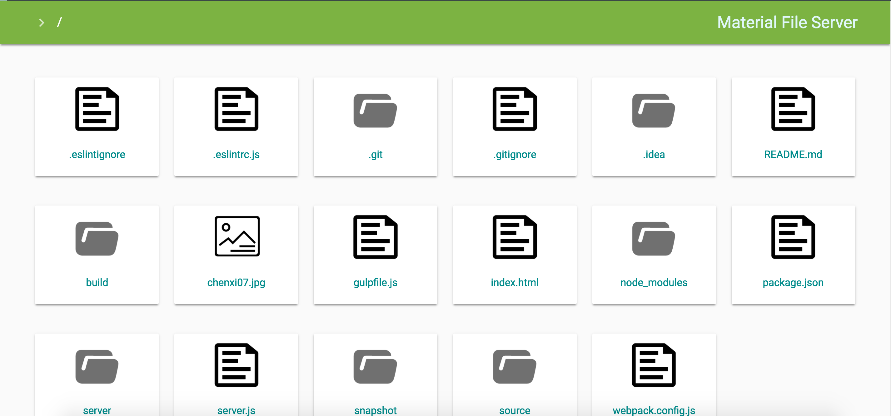

# react-material-fs

A file server maded by react and material design.




## Usage

```
git clone git@github.com:desmond1121/react-material-fs.git
cd react-material-fs
npm install
npm start ~/
```

**You must input a parameter as root dir of file server.**

## Customize

By default the file served at `http://localhost:8333`. You can change **host** and **port** by edit `package.jspn`:

```
"config" : {
    "host" : "localhost",
    "port" : "8333"
}
```

## Road Map

- File upload. 
- Image snapshot.
- UI beautify.